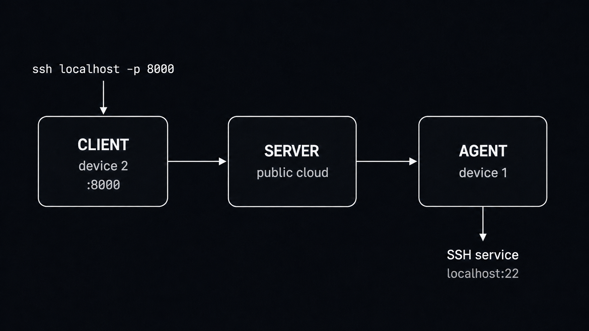

<div align="center">

# node-tunnel

**Reach private TCP services through your own public relay.**

[](https://github.com/mgrybyk/node-tunnel/actions/workflows/ci.yml)
[](https://nodejs.org/)
[](LICENSE)
[](package.json)

</div>

`node-tunnel` is a small, self-hosted reverse TCP tunnel. Run a relay on a
public host, an agent beside the private service, and a client wherever you
want to use it. SSH, RDP, databases, HTTP, and other TCP protocols all work
through the same three-process setup.

- **Self-hosted** — the relay runs on infrastructure you control.
- **NAT-friendly** — the agent and client connect out to the public relay.
- **Dependency-free at runtime** — built entirely on Node.js core modules.
- **Resilient** — reconnect backoff, TCP keepalive, and graceful shutdown are
  built in.

## How it works

The agent on device 1 and the client on device 2 both connect outward to the
public relay. The client exposes `127.0.0.1:8000`, which is routed through the
relay to `localhost:22` on device 1.



## Quick start tunnel SSH

You need Node.js 24 or newer on all three hosts. Clone and install the project
on each one:

```sh
git clone https://github.com/mgrybyk/node-tunnel.git
cd node-tunnel
npm ci
```

Generate a private 32-character key once, then use the result in every config:

```sh
openssl rand -hex 16
```

### 1. Start the relay

Create `relay.env` on the public host:

```dotenv
N_T_CRYPT_KEY=<same-32-character-key>
N_T_RELAY_BIND_HOST=0.0.0.0 # change to 127.0.0.1 if the relay is behind a proxy
N_T_RELAY_PORT=32121
```

Allow inbound TCP traffic to the relay port (`32121`), then start the relay:

```sh
npm run relay -- relay.env
```

### 2. Start the agent on device 1

Create `agent.env` beside the private SSH service:

```dotenv
N_T_CRYPT_KEY=<same-32-character-key>
N_T_RELAY_HOST=relay.example.com
N_T_RELAY_PORT=32121

N_T_AGENT_NAME=my-ssh
N_T_AGENT_DATA_HOST=127.0.0.1
N_T_AGENT_DATA_PORT=22
```

```sh
npm run agent -- agent.env
```

The target can also be another host reachable from device 1; set
`N_T_AGENT_DATA_HOST` accordingly.

### 3. Start the client on device 2

Create `client.env` where you want the local SSH entry point:

```dotenv
N_T_CRYPT_KEY=<same-32-character-key>
N_T_RELAY_HOST=relay.example.com
N_T_RELAY_PORT=32121

N_T_CLIENT_NAME=my-ssh
N_T_CLIENT_BIND_HOST=127.0.0.1 # change to 0.0.0.0 if you want other clients in your network to access the client port
N_T_CLIENT_PORT=8000
```

```sh
npm run client -- client.env
```

The client and agent names must match. Now connect on device 2:

```sh
ssh user@127.0.0.1 -p 8000
```


The same pattern works for any TCP service: change the agent target port, the
client's local port, and the route name.

### Using TLS and proxy

Add to all agents and clients:

```dotenv
N_T_USE_TLS=true
```

You have to generate certificates for your domain and use a TLS proxy. For example HAProxy. See HAProxy [haproxy.cfg](docs/haproxy.cfg) example.

## Deployment notes

- Relay, agent, and client must use the same protocol version. Incompatible
  peers log an error and exit.

<details>
<summary><strong>Reliability and lifecycle settings</strong></summary>

```dotenv
N_T_RECONNECT_DELAY_MS=5000
N_T_RECONNECT_MAX_DELAY_MS=30000
N_T_RECONNECT_JITTER_PERCENT=20
N_T_HANDSHAKE_TIMEOUT_MS=10000
N_T_CONTROL_IDLE_TIMEOUT_MS=45000
N_T_SHUTDOWN_TIMEOUT_MS=5000
```

Reconnects use capped exponential backoff with jitter. Established control and
tunnel sockets enable TCP keepalive after 30 seconds of inactivity; the OS
controls later probes. On `SIGINT` or `SIGTERM`, processes stop accepting work,
allow active streams a bounded drain period, and then close remaining sockets.

</details>

## JavaScript API

Imports have no side effects. Each entry point exposes a lifecycle factory:

```js
const { createRelay } = require('node-tunnel')

const relay = createRelay(options)
await relay.start()
await relay.close()
```

| Entry point | Export |
| --- | --- |
| `node-tunnel` | `createRelay` |
| `node-tunnel/agent` | `createAgent` |
| `node-tunnel/client` | `createClient` |
| `node-tunnel/config` | Environment-backed config builders |

## Security

> [!WARNING]
> TLS protects traffic to the public relay, but it is not end-to-end encryption.
> See [Security](docs/SECURITY.md).

This project is still a prototype. Use TLS and appropriate network hardening
when exposing it to untrusted networks.

## Development

See [ARCHITECTURE.md](docs/ARCHITECTURE.md) for module responsibilities, connection
flow, lifecycle ownership, and the transport boundary.

```sh
npm run check
npm test
npm run test:coverage
```

The end-to-end suite starts a real relay, two agents, and six clients. It
exercises 72 binary streams over three traffic waves, with 24 streams active in
parallel per wave and roughly 158 MiB transferred. CI runs checks and coverage
on Ubuntu and Windows.

### Benchmarking

See [BENCHMARK.md](docs/BENCHMARK.md) for the sustained 3-agent/12-client scenario,
outage preset, JSON reports, failure diagnostics, and comparison format.

For a release, also run `npm pack --dry-run`, update `CHANGELOG.md`, and bump
`PROTOCOL_VERSION` only when messages, framing, handshakes, or other wire
semantics become incompatible.
